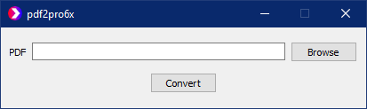
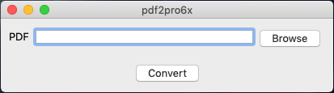

# pdf2pro6x
Convert PDF files to ProPresenter 6 Bundle files.

## Prerequisite
pdf2pro6x uses pdf2image which is based on poppler, so make sure you have the latter installed. See
[pdf2image](https://github.com/Belval/pdf2image#how-to-install).

## Releases
You can download an installer or a single file binary for macos or windows from the
[releases section](https://github.com/P1zz4br0etch3n/pdf2pro6x/releases).

## Usage
Just open the app, browse for a PDF file or paste its path and click `Convert`.\
The pro6x file will be saved at the same place as the PDF file.